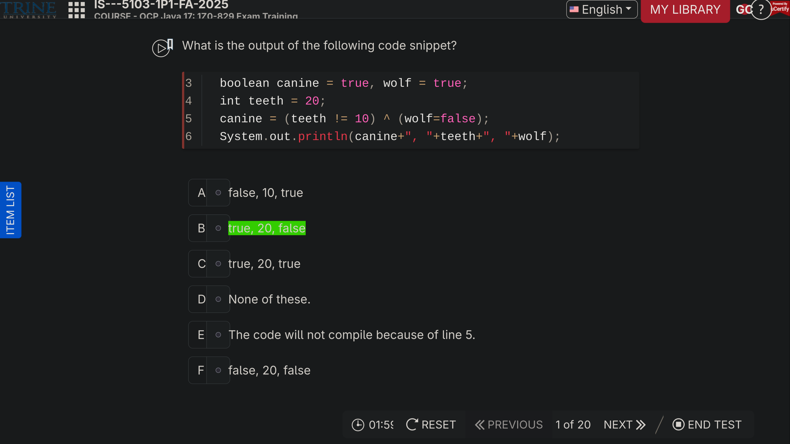
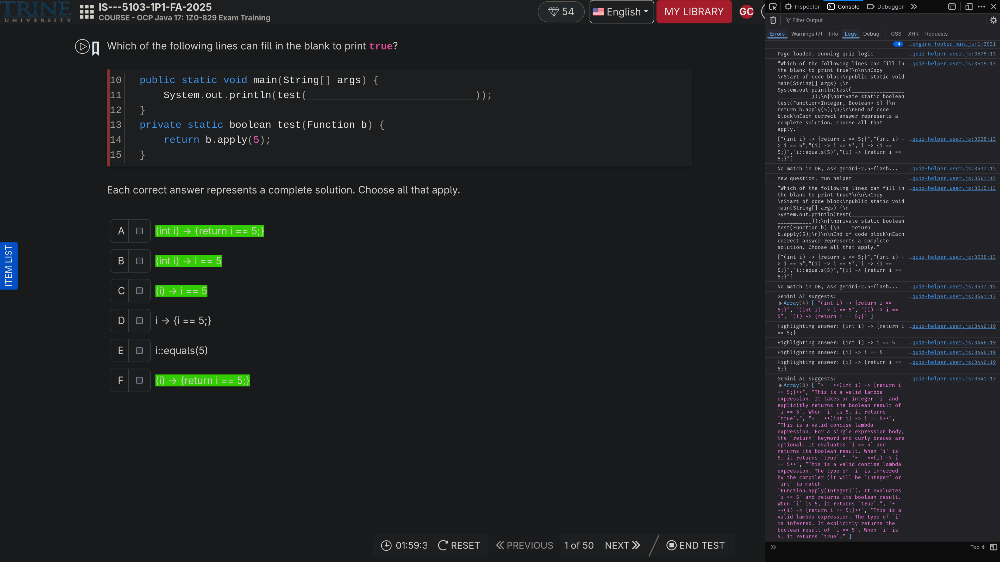
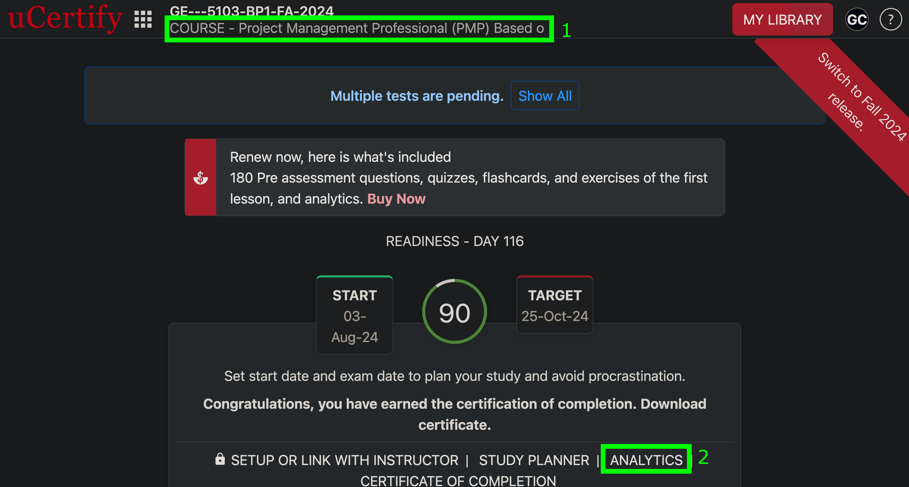
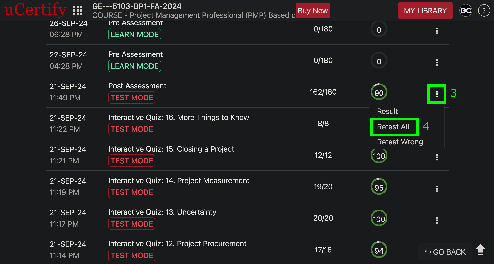

# ucertify-quiz-helper
only support choice questions

## demo


## course
- Advanced Database
- Project Management Professional (PMP) Based on PMBOK7

## usage
1. install [Tampermonkey](https://www.tampermonkey.net/)

[guide](https://www.tampermonkey.net/faq.php?locale=en#Q100)

2. install the script

click the link below

https://raw.githubusercontent.com/0guanhua0/ucertify-quiz-helper/refs/heads/main/helper.user.js

[guide](https://www.tampermonkey.net/faq.php?locale=en#Q102)

3. check browser console



## retake
retake can refresh score

### after quiz


### from course



## support
please file issues for support

or to modify the database db.js, always run the check
```sh
guanhua@arch ~/ucertify-quiz-helper (git)-[main] % npm run format
```

## roadmap
- [ ] use cv to get info. for text app, use [ocr](https://en.wikipedia.org/wiki/Optical_character_recognition)
- [ ] use ai to understand the context and answer the question

## tips
ai can help development, but it can introduce bugs. these kind of bugs are hard to debug because it seems correct.

ai can provide general suggestions, but final decision should base on the project context.

for text app, it's hard to deal with special characters. for example
```javascript
function normalizeText(text) {
  console.log("Normalizing text:", text);
  return text
    .replace(/’/g, "'")
    .replace(/–/g, "-")
    .replace(/“/g, '"')
    .replace(/”/g, '"');
}
```

possible solution:
- hash. but it's exact match, so any change will break
- ai. this add flexibility, but add extra cost

it's stupid to code database because it's easy to mess up and hard to debug. always run the full check before and after the change. i use .js as database just to make it easy for tampermonkey to pull the dependency.
