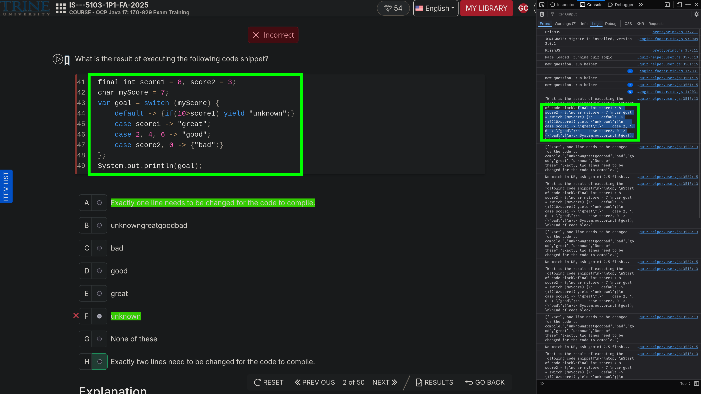

# ucertify-quiz-helper

## run
- install [tampermonkey](https://www.tampermonkey.net/)

- install [script](https://github.com/0guanhua0/ucertify-quiz-helper/raw/refs/heads/main/helper.user.js)

- set [gemini api key](https://aistudio.google.com/app/apikey) in script

- check browser console

### chrome
turn on developer mode

go to [chrome://extensions/](chrome://extensions/)

### contribute

